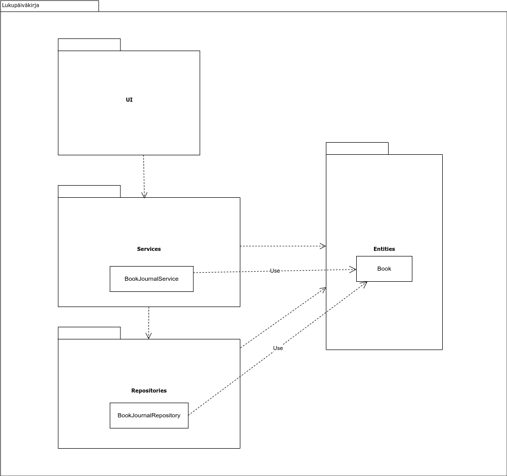
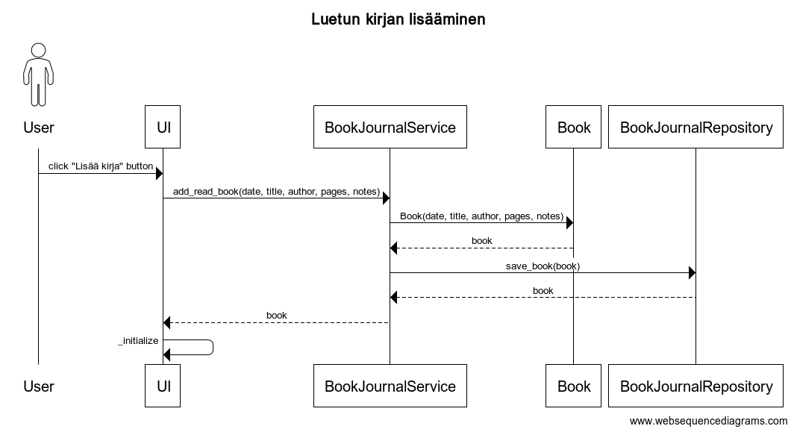
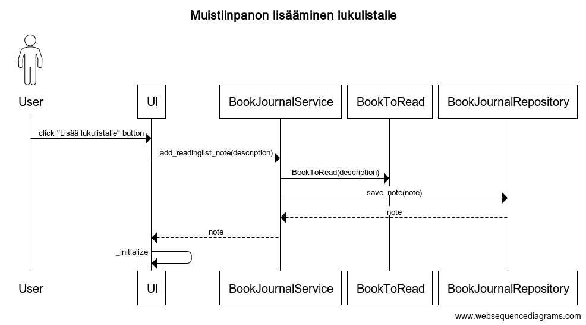
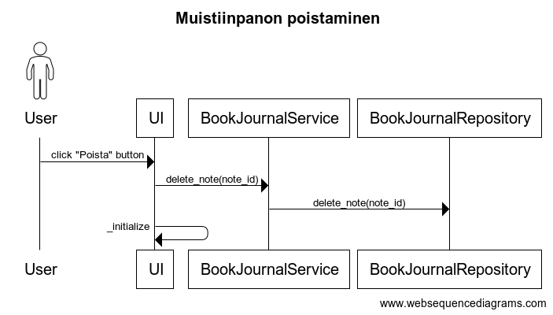

# Arkkitehtuurikuvaus

## Rakenne

Sovelluksen pakkausrakenne on seuraavanlainen:

- Pakkaus _ui_ vastaa käyttöliittymästä.
- Pakkaus _services_ vastaa sovelluslogiikasta.
    - _BookJournalService_ vastaa lukupäiväkirjan ja _ReadingListService_
      lukulistan sovelluslogiikasta.
- Pakkaus _repositories_ vastaa tietokantaoperaatioista.
    - _BookJournalRepository_ vastaa lukupäiväkirjan ja _ReadingListRepository_
      lukulistan tietokantaoperaatioista.
- Pakkaus _entities_ sisältää objektit:
    - _Book_, joka edustaa luettua kirjaa, sekä
    - _BookToRead_, joka edustaa muistiinpanoa kirjasta, jonka käyttäjä haluaa
      lukea.

Pakkaus _ui_ kutsuu pakkausta _services_, joka kutsuu tarvittaessa pakkausta
_repositories_. Sekä _services_ että _repositories_ käyttävät pakkauksen
_entities_ oliota.

## Toimintalogiikka

### Luetun kirjan lisääminen lukupäiväkirjaan

Käyttäjä täyttää lomakkeeseen luetun kirjan tiedot ja klikkaa painiketta "Lisää
kirja". Tämän jälkeen sovelluslogiikka etenee alla olevan sekvenssikaavion
mukaisesti.

### Muistiinpanon lisääminen lukulistalle

Käyttäjä täyttää lomakkeeseen muistiinpanon teoksesta, jonka haluaa lukea ja
klikkaa painiketta "Lisää lukulistalle". Tämän jälkeen sovelluslogiikka etenee
alla olevan sekvenssikaavion mukaisesti.

### Muistiinpanon poistaminen lukulistalta

Käyttäjä klikkaa muistiinpanon vieressä olevaa "Poista" -painiketta, jonka
jälkeen sovelluslogiikka etenee alla olevan sekvenssikaavion mukaisesti.

