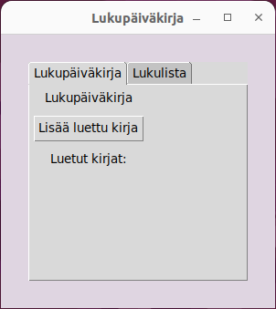
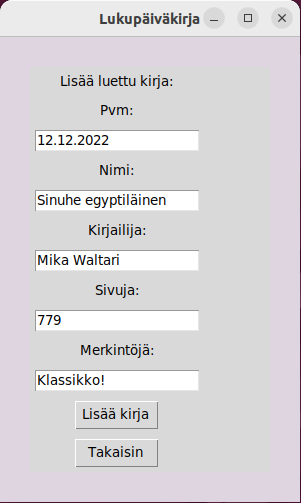
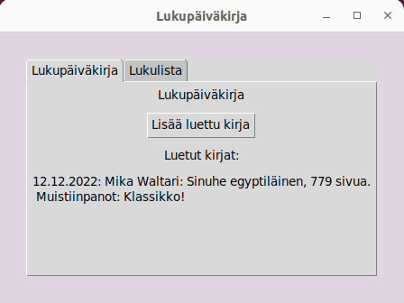
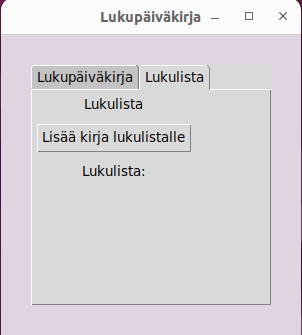
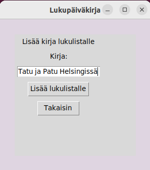
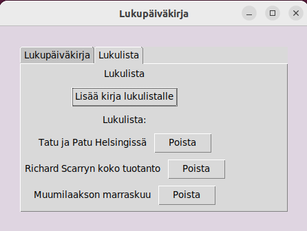

# Käyttöohje

Lataa viimeisin release
[täältä](https://github.com/tovento/ot-harjoitustyo/releases).

Sovelluksen käyttö vaatii [Poetryn](https://python-poetry.org/) asennuksen.

## Asennus ja käyttöönotto

Sovellus on kehitetty ja testattu Python-versiolla 3.10. On mahdollista, että sovellus ei toimi tarkoituksenmukaisesti vanhemmilla Pythonin versioilla.

Riippuvuudet asennetaan komennolla:

```bash
poetry install
```

Sovellus käynnistyy komennolla:

```bash
poetry run invoke start
```

## Kirjan lisääminen lukupäiväkirjaan

Ohjelma käynnistyy lukupäiväkirjanäkymään:



Klikkaamalla "Lisää luettu kirja" -nappia päästään lisäämään uusi luettu kirja
lukupäiväkirjaan. Avautuu näkymä, johon voidaan syöttää kirjan tiedot:



Lomakkeen kentistä pakollisia ovat "Pvm", "Nimi", "Kirjailija" sekä "Sivuja".
Kenttä "Merkintöjä" on vapaaehtoinen, ja sen voi halutessaan jättää tyhjäksi. Klikkaamalla "Lisää kirja" -nappia kirja tallentuu lukupäiväkirjaan. Sovellus
siirtyy päivittyyn lukupäiväkirjanäkymään:



Näkymässä näkyvät nyt kaikki lukupäiväkirjaan tallennetut luetut kirjat,
viimeisimpänä lisätty kirja ylimmäisenä.

## Lukulistan käyttäminen

Lukupäiväkirjasta voidaan siirtyä lukulistanäkymään painamalla "Lukulista"
-välilehteä:



Klikkaamalla "Lisää kirja lukulistalle" -nappia päästään lisäämään uusi
kirja tai muistiinpano lukulistalle. Muistiinpano on vapaamuotoinen ja se voi
olla esimerkiksi kirjan tai kirjailijan nimi.  Avautuu näkymä, johon voidaan lisätä
muistiinpano:



Klikkaamalla "Lisää lukulistalle" -nappia muistiinpano tallentuu lukulistalle.
Sovellus siirtyy takaisin lukupäiväkirjan aloitusnäkymään. Klikkaamalla
"Lukulista"-välilehteä käyttäjä näkee jälleen lukulistan, joka on nyt
päivittynyt sisältämään uusimman muistiinpanon. Uusin muistiinpano näkyy
alimmaisena.

Kun käyttäjä on lukenut lukulistalla olevan teoksen tai haluaa muusta syystä poistaa
sen, onnistuu se lukulistanäkymässä. Jokaisen muistiinpanon vieressä näkyy
"Poista"-nappi, jota painamalla muistiinpano poistuu lukulistalta:


