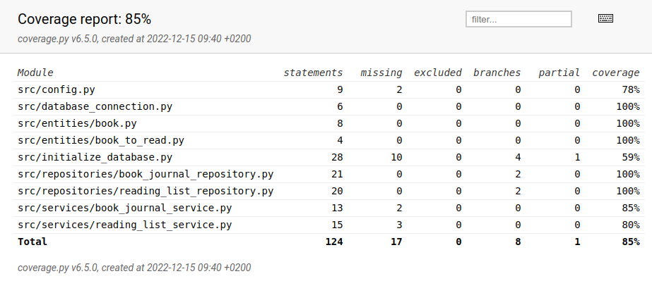

# Testausdokumentti

## Automaattiset testit

Sovelluslogiikkaa testataan
[TestBookJournalService](https://github.com/tovento/ot-harjoitustyo/blob/master/src/tests/services/book_journal_service_test.py)
ja
[TestReadingListService](https://github.com/tovento/ot-harjoitustyo/blob/master/src/tests/services/reading_list_service_test.py)
-luokilla.

Reporitorio-luokkia testataan
[TestBookJournalRepository](https://github.com/tovento/ot-harjoitustyo/blob/master/src/tests/repositories/book_journal_repository_test.py)
ja
[TestReadingListRepository](https://github.com/tovento/ot-harjoitustyo/blob/master/src/tests/repositories/reading_list_repository_test.py)
-luokilla.

Testauskattavuus on 85 %. Testauskattavuutta laski mm. konfiguraatiotiedoston
ja tietokannan alustustiedoston testaamattomuus.

## Manuaalinen testaus

Lisäksi sovellusta on testattu manuaalisesti. Manuaalisella testauksella on
varmistettu, että sovellus ei kaadu ja toimii odotetunlaisesti. Sovellus ei esimerkiksi
anna tallentaa kirjoja tai muistiinpanoja, jos vaadittuja kenttiä ei ole
täytetty. Toisaalta sovellus ei tarkasta syötteitä eikä estä käyttäjää tallentamasta esimerkiksi
pelkkiä välilyöntejä.

Sovelluksen toiminnallisuudet on käyty läpi, ja kirjojen
ja muistiinpanojen lisääminen toimii odotetunlaisesti. Ohjelmaa ei ole testattu
laajasti suurilla määrillä tallennuksia. Ohjelma sopii myös suurten kirjamäärien
tallennukseen, mutta käyttökokemukseltaan se ei tämänhetkisessä muodossaan ole
optimaalinen suurten aineistojen käsittelyyn.
