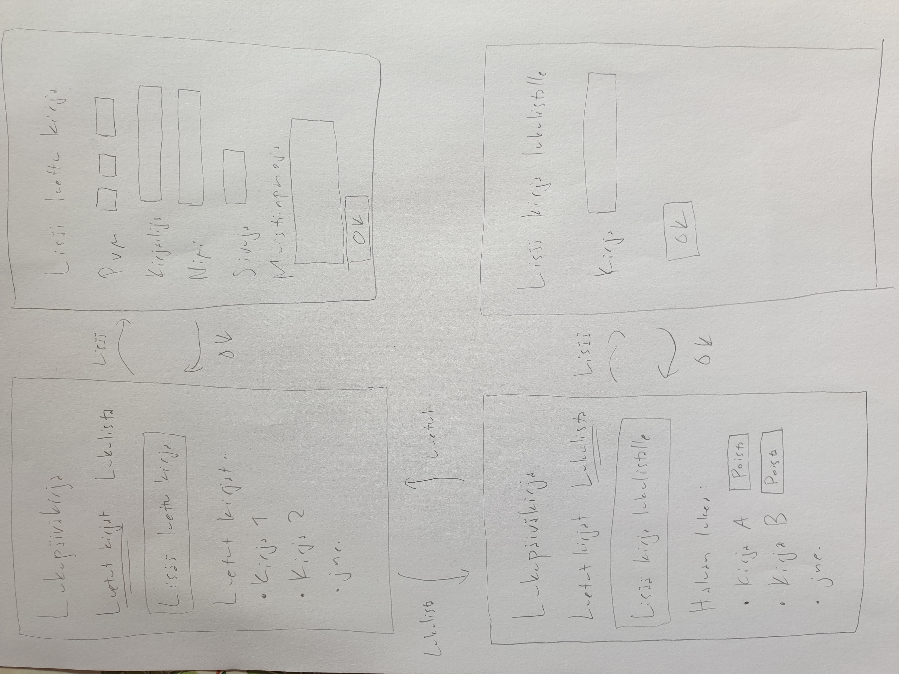

# Vaatimusmäärittely

## Sovelluksen tarkoitus

Lukupäiväkirjan avulla käyttäjä voi kirjata muistiin tietoja lukemistaan
kirjoista sekä pitää listaa kirjoista, jotka haluaa lukea.

## Käyttöliittymäluonnos

Sovellus koostuu neljästä näkymästä.

Sovelluksessa on kaksi perusnäkymää: luetut kirjat ja lukulista. Molemmista
perusnäkymistä pääsee lisäämään kirjoja listalle. Lukulistalle kirjan voi
lisätä vapaamuotoisesti, esimerkiksi vain nimen perusteella. Luetusta kirjasta
käyttäjä voi halutessaan lisätä tarkempia tietoja, kuten päivämäärän ja
sivunumerot.

## Perusversion suunnitellut toiminnallisuudet

- Käyttäjä näkee listan lukemistaan kirjoista. *Tehty*
- Käyttäjä voi lisätä lukupäiväkirjaan luetun kirjan. *Tehty*
- Luetuista kirjoista voidaan tallentaa seuraavat tiedot: päivämäärä, kirjailija, kirjan
  nimi, sivumäärä, vapaata tekstiä. *Tehty*
- Käyttäjä voi tehdä lukulistan eli listan kirjoista, jotka haluaa lukea.
  *Tehty*
- Lukulistalta voi poistaa kirjoja.

## Mahdollisia laajennuksia

- Luettujen kirjojen hakeminen ajanjakson, nimen tms. perusteella.
