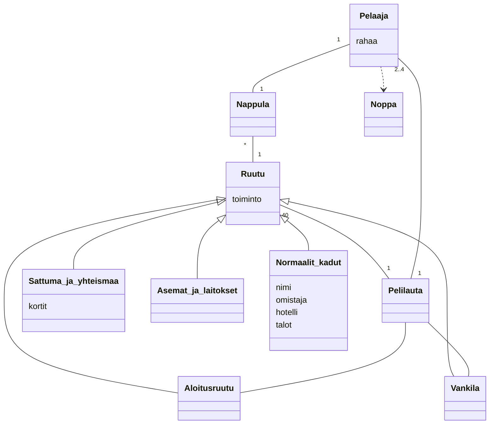

```mermaid
 classDiagram
      Pelaaja "1" -- "1" Nappula
      class Pelaaja{
          rahaa
      }
      
      Nappula "*" -- "1" Ruutu
      Ruutu "40" -- "1" Pelilauta
      class Ruutu{
          toiminto
      }
      
      Pelaaja ..> Noppa
      Pelaaja "2..4" -- "1" Pelilauta
      
      Ruutu <|-- Aloitusruutu
      Pelilauta -- Aloitusruutu
      
      Ruutu <|-- Vankila
      Pelilauta -- Vankila
      
      
      Ruutu <|-- Sattuma_ja_yhteismaa
      class Sattuma_ja_yhteismaa{
          kortit
      }
      
      Ruutu <|-- Asemat_ja_laitokset
      
      
      Ruutu <|-- Normaalit_kadut
      class Normaalit_kadut{
          nimi
          omistaja
          hotelli
          talot
      }
```
